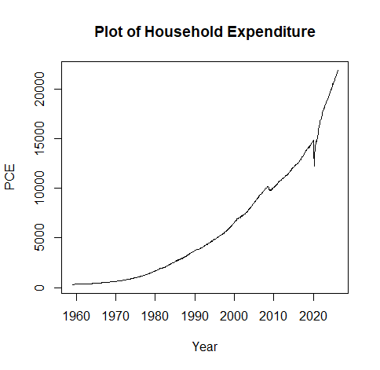
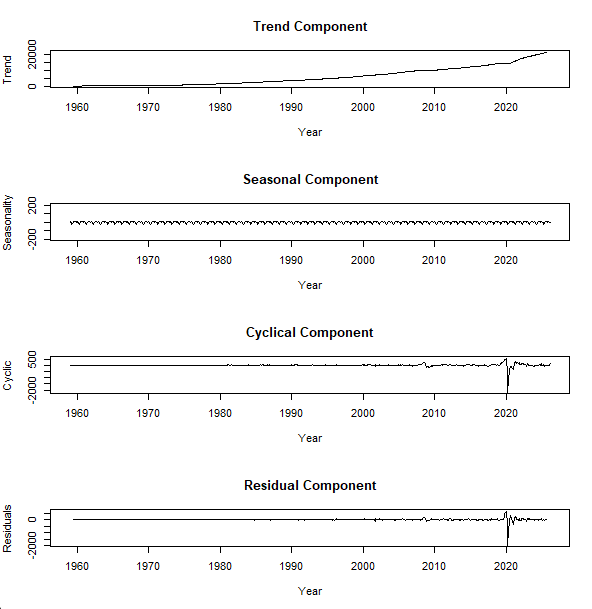
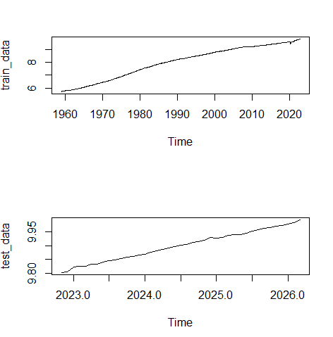
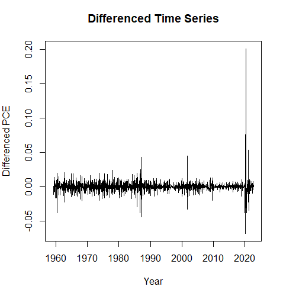
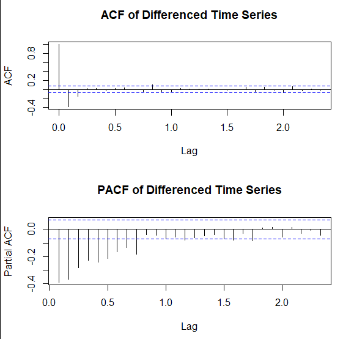
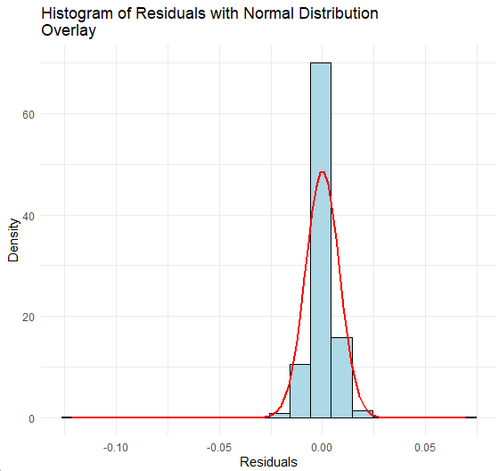
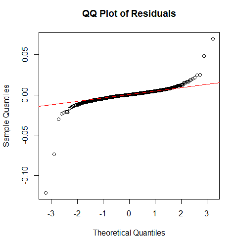
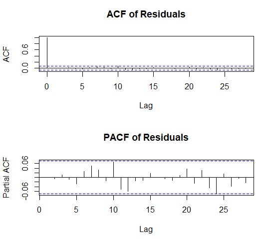
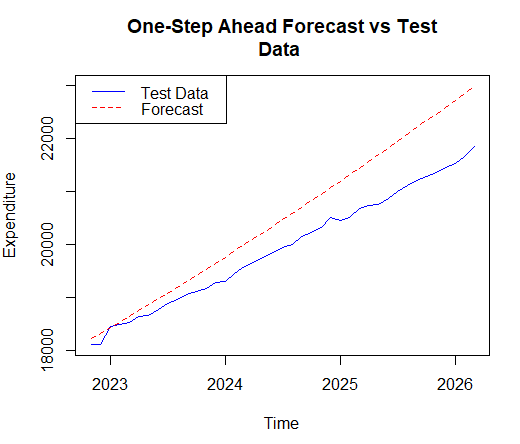
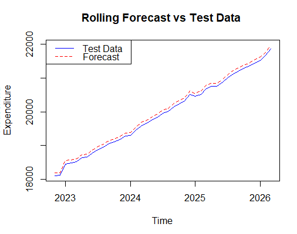

# 📊 Household Expenditure Forecasting (ARIMA)
## 🚀 Project Summary  
This project focuses on forecasting household expenditure using the Auto-Regressive Integrated Moving Average (ARIMA) model. The aim is to analyze historical expenditure patterns and generate reliable forecasts that can support economic planning and decision-making.

Household expenditure is a critical economic indicator, but it is often highly volatile, influenced by factors such as income variability, seasonal effects, and broader economic conditions. These fluctuations create uncertainty for businesses, policymakers, and financial institutions, making accurate forecasting essential.

The ARIMA model was chosen because it effectively captures both short-term fluctuations and long-term trends in time series data.
## 🎯 Objectives
### General Objective
- To forecast household expenditure using the ARIMA model
### Specific Objectives
- Fit an ARIMA model to the data
- Test the adequacy of the fitted model
- Generate forecasts
- Evaluate the accuracy of the forecasts

This project follows the Box-Jenkins methodology, a structured approach to time series modeling.
## 📊 Data Source
The dataset used in this study was sourced from the Federal Reserve Economic Data (FRED)
website, specifically the series on personal consumption expenditures (PCE), available at https://fred.stlouisfed.org/series/PCE. The data spans the period from January 1, 1959, to
March 1, 2026. The variable represents total monthly household expenditure expressed at a seasonally
adjusted annual rate. This means that the data has been adjusted to remove seasonal fluctuations,
providing a clearer view of underlying trends.
## 📊 Data Description
  

From the figure there is a clear upward trend in the data, indicating consistent growth in household expen
ditures from 1960 to 2026. This trend becomes particularly pronounced in recent years, suggesting
an accelerating rate of increase. The plot also highlights notable dips in expenditures during the  periods of 2008-2009 and 2020, which are likely associated with the Global Financial Crisis and the 
COVID-19 pandemic, respectively. These downturns are followed by strong recoveries, reinforcing
the resilience of household spending over time.
### 1. Time Series Decomposition  

  

From the figure above
- The trend component illustrates a consistent upward trajectory over the entire period, representing
long-term growth in household spending.
-  The seasonal component exhibits small or negligible fluctuations as a result of the seasonal adjustment done to the data.
- The cyclical component reveals medium-term deviations that are not tied to seasonality but instead to broader economic cycles.
- The residual component is relatively flat in the early years however in resent years the residuals show larger fluctuations.
#### Note
The fluctuating variance in household expenditure poses a potential
issue for fitting an ARIMA model, which assumes a more stable variance over time. To address this issue, a logarithmic transformation is applied to the series. This is crucial for stabilizing the
variance, ensuring that the ARIMA model can effectively capture the patterns in the data without being skewed by the increasing scale of expenditures in recent years.

## 🧠 Analytics Workflow
This project follows the box-jenkins methodology, a structured approach to time series modelling.
### 1. Data Preparation
The tranformed data is first split into a training and testing set in a 95:5 ratio.

### 2. Stationarity check
To assess the stationarity of the time series data, the Augmented Dickey-Fuller test is employed on the training set.
- The test yield a **test statistic of 0.004086** and a **p-value of 0.99**. This results in the failure of the rejection of the null hypothesis (non stationarity) since the p-value is greater than the chosen **significance level (0.05)**.
- To fix the issue of non stationary further differencing is perfomed. At the second differencing operation, the series attains stationarity with the test giving out a **test statistic of -16.076** and a **p_value of 0.01**

### 2. Model Identification (ACF & PACF)
  

Acf helps identify moving average terms while PACF helps identify Autoregressive terms.
- The ACF plot of the differenced series reveals a significant spike at lag 1, which quickly
dissipates to near-zero by lag 2, with subsequent lags showing no significant spikes and remaining
well within the confidence bands. This behaviour is typical of a **moving avarage process of order 1 or 2**. 
- The PACF plot reveals significant negative spikes in the range between **lag 1 all the way to 9**. This pattern points to the possiblity of an AR process with lag values falling the range.
### 3. Fitting an ARIMA model 
The candidate ARIMA models identified from the Auto-correlation and Partial Auto-correlation function plots are fitted to the differenced transformed household expenditure data. These models are specified with different
orders of autoregression **(AR)**, differencing **(I)**, and moving average **(MA)** components. The results are recorded for model selection.
### 4. Selecting the best Arima model
The selection of the best ARIMA model is based on three information criteria: the Hannan-Quinn
Criterion (HQC), Akaike Information Criterion (AIC), and Bayesian Information Criterion (BIC).
The table below presents the AIC, BIC, and HQC values for the candidate models fitted to the data. A
comparison of the performance metrics indicats that the **ARIMA(2,2,2)** model exhibits the lowest
values across all criteria, making it the most suitable model for predicting household expenditure.
| Model           | AIC         | BIC         | HQC         |
|-----------------|-------------|-------------|-------------|
| ARIMA(1,2,1)    | -5134.626   | -5120.711   | -5133.053   |
| ARIMA(1,2,2)    | -5139.270   | -5120.715   | -5135.910   |
| ARIMA(2,2,1)    | -5157.827   | -5139.273   | -5154.467   |
| **ARIMA(2,2,2)**| **-5164.273** | **-5141.080** | **-5159.126**   |
| ARIMA(3,2,1)    | -5160.173   | -5136.980   | -5155.027   |
| ARIMA(3,2,2)    | -5155.400   | -5127.569   | -5148.467   |
| ARIMA(4,2,1)    | -5161.622   | -5133.791   | -5154.689   |
| ARIMA(4,2,2)    | -5161.308   | -5128.838   | -5152.588   |
| ARIMA(5,2,1)    | -5162.779   | -5130.309   | -5154.059   |
| ARIMA(5,2,2)    | -5160.784   | -5123.675   | -5150.278   |
### 5. Parameter estimation of the fitted model
The parameters for the selected ARIMA(2,2,2) model were estimated using maximum likelihood
estimation. The table below presents the estimated coefficients for the autoregressive (AR(1)) and moving
average (MA(1)) components, along with their corresponding standard errors.
| Parameter | ar1    | ar2     | ma1     | ma2    |
|-----------|--------|---------|---------|--------|
| Coefficient | 0.5376 | -0.2008 | -1.4981 | 0.5139 |
| Std. Error  | 0.1132 | 0.0373  | 0.1130  | 0.1110 |
### 6. Model Diagnostics (Adequacy Testing)
To ensure the model is reliable, several diagnotic tests are conducted.
#### a) Normality of Residuals
- Tested using the **shapiro-wilk test**. The test yielded  a **test statistic of 0.64572** and a **p-value (2.2e-16)** which is less than zero. 
- Since the p-value is significantly smaller than the chosen **significance level (0.05)**, the null hypothesis that the residuals follow a normal distribution was rejected. This indicates some deviation from normality in the model’s residuals, which necessitates further investigation through graphical diagnostics.
  

Overall, the distribution appears to approximate a normal shape, with the bulk of the residuals
centered near zero. However, there are slight deviations at the tails. The left tail seems marginally elongated, indicating a potential negative skew, while the right tail shows a slightly sharp cutoff. This tail behavior suggests that while the residuals are somewhat symmetric, there are minor departures from perfect normality at the extremes.  

   

For most of the distribution, the points lie reasonably close to the reference line, indicating that the central portion of the residuals behave as expected under normality. However, deviations become apparent in the tails. In the context of fitting an arima model, these findings suggests that the model perfoms reasonably well.
#### b) Residual Autocorrelation Analysis

- The Autocorrelation Function plot illustrates a significant spikeat **lag0**, indicating a strong correlation between the values of the series at the same timepoint. However, as we examine the subsequent lags, they remain within the 95% confidence intervals,which signifies the absence of significant autocorrelation beyond the zero lag. This observation suggests that the model has effectively accounted for the temporal dependencies in the data and any correlation in the residuals is minimal.
- The PACF reveals that there are no significant spikes that exceed the confidence interval impling that the correlations have been well captured by the model

- To further validate the findings from the ACF and PACF plots, the **Ljung-Box test** is conducted.
This test yields a **Chi-squared test statistic of 14.816**, accompanied by a **probability value of 0.7868**. Since this probability value is greater than the conventional **significance level of 0.05**, we fail to reject the null hypothesis of no autocorrelation in the residuals. This result provides strong evidence that the model has adequately captured the underlying dynamics of the data.
#### c) Stationarity of residuals
The stationarity of the residuals is examined using the **Augmented Dickey-Fuller test**. The test yielded a **Dickey-Fuller statistic of-7.6953**, with a **probability value of 0.01**, leading to the rejection of the null hypothesis of non-stationarity. This result confirms that the differencing operations applied in the ARIMA model are effective in removing non-stationary components from the original time
series. The stationary residuals supports the conclusion that the model has sufficiently transformed the data and is appropriate for forecasting purposes.
### 7. Forecasting
Two forecastng approaches are used:
 - One step a head 
 - Rolling forecast
#### a) One-Step Ahead Forecast

  

The forecasted values diverge significantly from the actual data over time. Despite the
test data showing a steady upward trend, the one-step ahead forecast predicts a much flatter trajectory,
failing to capture the increasing trend in household expenditure. This indicates that the model lacks
adaptability, and its static forecast is insufficient to keep pace with the evolving patterns in the data.
#### b) Rolling Forecast

  

The rolling forecast is consistently able to adjust to changes in the data as new information is incorporated at each step. This adaptive nature allows it to better capture the upward trends
and minor fluctuations in household expenditure.
- In comparing the two methods, the rolling forecast outperforms the one-step-ahead forecast by a
considerable margin. The rolling forecast’s ability to continuously update the model as new data
points become available makes it far more responsive to changes in trends over time.
### 8. Forecast Accuracy Evaluation
Two key metrics were used:
- a) Mean Squared Error(MSE)
  - Measures average squared prediction error
  - One-step forecast: **456,366.7 (high error)**
  - Rolling forecast: **8,649.157 (very low error)**
- b) Theil's Inequality Coefficient
  - Measures forecast accuracy relative to a naive model
  - One-step: **0.6342884 → poor performance**
  - Rolling: **0.08732059  → very accurate**

This performance comparison
underscores the advantages of employing rolling forecasts in time series analysis, particularly when
dealing with evolving data trends.
## Summary and Conclution
This project set out to forecast household expenditure using the ARIMA model, applying the Box-Jenkins methodology to monthly personal consumption expenditure data from 1959 to 2026. The analysis revealed a clear long-term upward trend in household spending, punctuated by notable downturns during major economic disruptions such as the 2008 Global Financial Crisis and the 2020 COVID-19 pandemic. After addressing issues of non-stationarity through differencing and stabilizing variance with a logarithmic transformation, several ARIMA models were tested.

The ARIMA(2,2,2) model was selected as the best fit based on AIC, BIC, and HQC criteria. Diagnostic checks confirmed that the model adequately captured the underlying dynamics of the data, with residuals showing no significant autocorrelation and stationarity being achieved. While the one-step-ahead forecast struggled to capture the upward trajectory of household expenditure, the rolling forecast proved far more effective, adapting to new data and producing highly accurate predictions. Evaluation metrics reinforced this finding: the rolling forecast achieved a much lower Mean Squared Error and Theil’s Inequality Coefficient compared to the one-step-ahead approach.

In conclusion, the study demonstrates that ARIMA modeling, particularly when combined with rolling forecasts, provides a robust framework for predicting household expenditure. The results highlight the importance of adaptive forecasting methods in capturing evolving economic trends. These insights can support policymakers, businesses, and financial institutions in planning and decision-making, especially in contexts where household spending patterns are critical indicators of economic health.
## 🛠️ Tools & Technologies
- R Programming
- Packages:
  - forecast
  - tseries
- Techniques:
  - ARIMA Modeling
  - ADF Test
  - ACF & PACF Analysis
  - Forecast Evaluation Metrics
## 📌 Applications
- Economic forecasting
- Business demand planning
- Financial risk modeling
- Policy formulation
## 💡 Future Improvements
- Implement SARIMA for seasonality
- Compare with Machine Learning models (LSTM)
- Deploy as a real-time forecasting system

